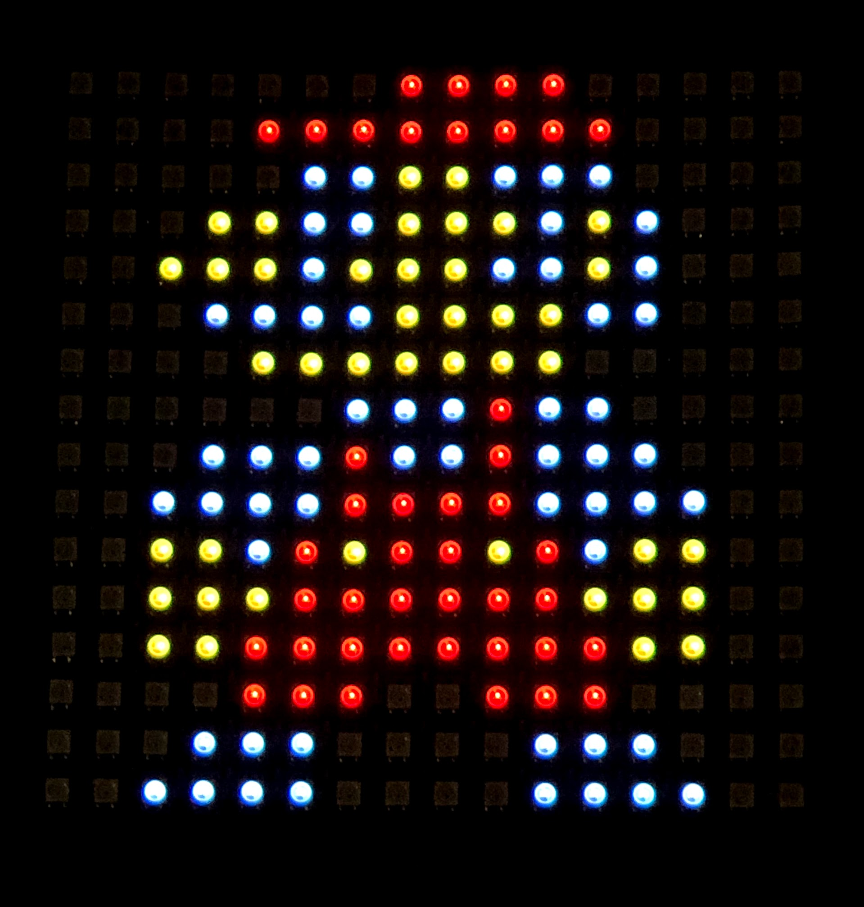

# Rasp-WS2812b
Power WS2812b LEDs from your Raspberry Pi over SPI. This library leverages the Raspberry Pi's SPI interface through Linux's IOCTL sys calls in order to emulate the data transfer method required by the WS2812b.

**Note:** This is currently a heavy WIP. It is almost certainly unstable, and is subject to breaking changes.

## How it works?
The LEDs run with a scan frequency of no less than `400Hz`, with a data transfer rate of `800kbps`.

The traditional method of communication with the WS2812b is usually PWM. The duty cycle to send a single bit is:

| Bit | Time High | Time Low | Duty % |
|-----|-----------|----------|--------|
| 0   | 0.4us     | 0.85us   | 32%    |
| 1   | 0.8us     | 0.45us   | 64%    |

A visual of the protocol is below.

```
PWM LED (0): where
    on time  = 0.4us +/-150ns
    off time = 0.8us +/-150ns
    
Volts
    |    START                      END
    |    v                          v
    |    ----------
    |    |        |
    |    |        |
    |    |        |
    | ----        -------------------
    *-------------------------------- Time
    
PWM LED (1): where
   on time  = 0.8us +/-150ns
   off time = 0.4us +/-150ns
   
Volts
    |    START                      END
    |    v                          v
    |    ------------------
    |    |                |
    |    |                |
    |    |                |
    | ----                -----------
    *-------------------------------- Time
```

Looking at the above duty cycle lengths, we can approximate each time slice into another 3 periods, each **33%** of the original wavelength in order to have constant high/low runs for the given period. This will allow us to continue using SPI, using a clock speed of approximately `3Mhz`.

To interact over SPI, each traditional LED sequence (3 bytes, 8 bits per colour channel) needs to be converted to a 9 byte sequence (72 bits per colour channel) before being shifted over SPI. Each traditional PWM 'bit' gets turned into an equivalent 3 SPI bits, and the clock speed of the SPI interface set to achieve within the `+/-150ns` error margins.

With the traditional period broken into 3 time sections, each can be pulled high or low individually. We can therefore represent what would have been a PWM (1) with an SPI `110`. And on the contrary, represent a PWM (0) with an SPI `100`.

## Example
An example of a Raspberry Pi controlling a flexible panel of WS2812b's:

(Mario)


## License
Licensed under the GNU GPLv3.0
